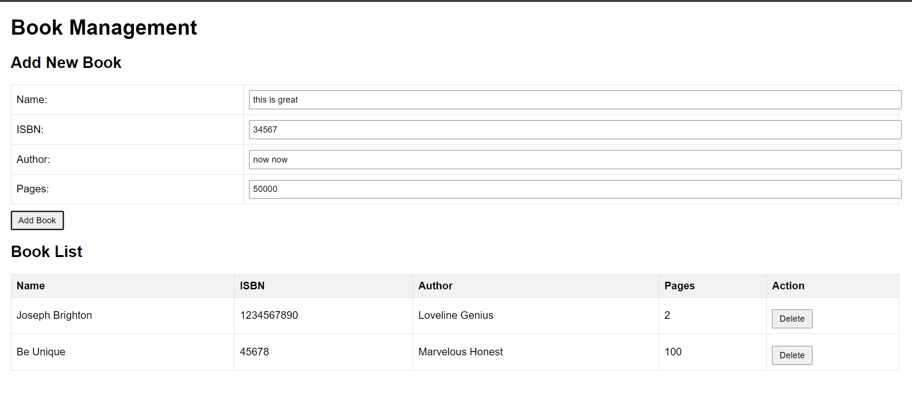

# Introduction
Introduction
The MEAN stack is a powerful JavaScript framework used for building modern web applications. MEAN stands for MongoDB, Express.js, AngularJS (or Angular), and Node.js. Each component plays a crucial role in creating a full-stack application that is efficient, scalable, and easy to maintain.

MongoDB
__MongoDB:__  is a NoSQL database that stores data in a flexible, JSON-like format. It is widely used for web applications due to its scalability, flexibility, and performance. In this project, we will use MongoDB to store book records, which include the book name, ISBN number, author, and number of pages.

Express.js
__Express.js:__  is a web application framework for Node.js that simplifies the process of building web applications and APIs. It provides essential features such as routing, middleware support, and templating engines, allowing developers to create robust applications with ease.

AngularJS (or Angular)
__AngularJS:__  maintained by Google, is a JavaScript framework used for building dynamic web applications. It enhances HTML with additional attributes and provides built-in directives for creating interactive user interfaces. AngularJS follows the Model-View-Controller (MVC) architecture, which helps in organizing code and developing complex applications efficiently.

Node.js
__Node.js:__ is a JavaScript runtime built on Chrome's V8 JavaScript engine, enabling developers to run JavaScript code outside the web browser. It is known for its event-driven, non-blocking I/O model, making it ideal for building scalable and high-performance web applications.

Step 0: Prerequisites
EC2 Instance: Launch a t3.small EC2 instance with Ubuntu 22.04 LTS (HVM) in the us-east-1 region using the AWS console.

## Step 0: Prerequisites

__1.__ EC2 Instance of t3.small type and Ubuntu 22.04 LTS (HVM) was lunched in the us-east-1 region using the AWS console.

__2.__ Attached SSH key named __my-ec2-key__ to access the instance on port 22

__3.__ The security group was configured with the following inbound rules:

- Allow traffic on port 80 (HTTP) with source from anywhere on the internet.

- Allow traffic on port 443 (HTTPS) with source from anywhere on the internet.

- Allow traffic on port 22 (SSH) with source from any IP address. This is opened by default.

- Allow traffic on port 3300 (Custom TCP) with source from anywhere.

__4.__ The private ssh key permission was changed for the private key file and then used to connect to the instance by running
```
chmod 400 my-ec2-key.pem
```
```
ssh -i "my-ec2-key.pem" ubuntu@54.81.119.2
```
Where __username=ubuntu__ and __public ip address=yourip__


## Step 1 - Install Nodejs

Node.js is a JavaScript runtime built on Chrome’s V8 JavaScript engine. Node.js is used in this tutorial to set up the Express routes and AngularJS controllers.

__1.__ __Update and Upgrade ubuntu__

```
sudo apt update && sudo apt upgrade -y
```


__2.__ __Add certificates__

```
sudo apt -y install curl dirmngr apt-transport-https lsb-release ca-certificates
```


```
curl -sL https://deb.nodesource.com/setup_18.x | sudo -E bash -
```

__.3__ __Install NodeJS__

```
sudo apt-get install -y nodejs
```


## Step 2 - Install MongoDB

For this application, Book records were added to MongoDB that contain book name, isbn number, author, and number of pages.

__1.__ __Download the MongoDB public GPG key__

```bash
curl -fsSL https://pgp.mongodb.com/server-7.0.asc | sudo gpg --dearmor -o /usr/share/keyrings/mongodb-archive-keyring.gpg
```

__2.__ __Add the MongoDB repository__

```
echo "deb [ signed-by=/usr/share/keyrings/mongodb-archive-keyring.gpg ] https://repo.mongodb.org/apt/ubuntu jammy/mongodb-org/7.0 multiverse" | sudo tee /etc/apt/sources.list.d/mongodb-org-7.0.list
```


__3.__ __Update the package database and install MongoDB__

```
sudo apt-get update
```
While installing Mongodb, you may encounter some errors, 
this usually happens if your server is of different types
below is a code for Ubuntu jammy 22.04
```
sudo apt-get install gnupg curl

curl -fsSL https://www.mongodb.org/static/pgp/server-7.0.asc | \
sudo gpg -o /usr/share/keyrings/mongodb-server-7.0.gpg \ --dearmor

echo "deb [ arch=amd64,arm64 signed-by=/usr/share/keyrings/mongodb-server-7.0.gpg ] https://repo.mongodb.org/apt/ubuntu jammy/mongodb-org/7.0 multiverse" | sudo tee /etc/apt/sources.list.d/mongodb-org-7.0.list

sudo apt-get update 
sudo apt-get install -y mongodb-org

```
here is for for Ubuntu 20.04 focal
```
echo "deb [ arch=amd64,arm64 signed-by=/usr/share/keyrings/mongodb-server-7.0.gpg ] https://repo.mongodb.org/apt/ubuntu focal/mongodb-org/7.0 multiverse" | sudo tee /etc/apt/sources.list.d/mongodb-org-7.0.list

sudo apt-get update

sudo apt-get install -y mongodb-org

```

```
sudo apt-get install -y mongodb-org
```


__4.__ __Start and enable MongoDB__

```
sudo systemctl start mongod
```
```
sudo systemctl enable mongod
```
```
sudo systemctl status mongod
```


__5.__ __Install body-parser package__

__body-parser__ package is needed to help process JSON files passed in requests to the server.

```
sudo npm install body-parser
```


__6.__ __Create the project root folder named ‘Books’__

```
mkdir Books && cd Books
```

Initialize the root folder
```
npm init
```


__Add file named server.js to Books folder__

```
vim server.js
```
Copy and paste the web server code below into the server.js file.

```
const express = require('express');
const bodyParser = require('body-parser');
const mongoose = require('mongoose');
const path = require('path');

const app = express();
const PORT = process.env.PORT || 3300;

// MongoDB connection
mongoose.connect('mongodb://localhost:27017/test', {
  useNewUrlParser: true,
  useUnifiedTopology: true,
})
.then(() => console.log('MongoDB connected'))
.catch(err => console.error('MongoDB connection error:', err));

app.use(express.static(path.join(__dirname, 'public')));
app.use(bodyParser.json());

require('./apps/routes')(app);

app.listen(PORT, () => {
  console.log(`Server up: http://localhost:${PORT}`);
});

```


## Step 3 - Install Express and set up routes to the server

Express was used to pass book information to and from our MongoDB database.
Mongoose package provides a straightforward schema-based solution to model the application data. Mongoose was used to establish a schema for the database to store data of the book register.

__1.__ __Install express and mongoose__

__2.__ __In Books folder, create a folder named ‘apps’__

```
mkdir apps && cd apps
```
__In apps, create a file named routes.js__

```
vim routes.js
```


Copy and paste the code below into routes.js
```
const Book = require('./models/book');
const path = require('path');

module.exports = function(app) {
  app.get('/book', async (req, res) => {
    try {
      const books = await Book.find();
      res.json(books);
    } catch (err) {
      res.status(500).json({ message: 'Error fetching books', error: err.message });
    }
  });

  app.post('/book', async (req, res) => {
    try {
      const book = new Book({
        name: req.body.name,
        isbn: req.body.isbn,
        author: req.body.author,
        pages: req.body.pages
      });
      const savedBook = await book.save();
      res.status(201).json({
        message: 'Successfully added book',
        book: savedBook
      });
    } catch (err) {
      res.status(400).json({ message: 'Error adding book', error: err.message });
    }
  });

  app.delete('/book/:isbn', async (req, res) => {
    try {
      const result = await Book.findOneAndDelete({ isbn: req.params.isbn });
      if (!result) {
        return res.status(404).json({ message: 'Book not found' });
      }
      res.json({
        message: 'Successfully deleted the book',
        book: result
      });
    } catch (err) {
      res.status(500).json({ message: 'Error deleting book', error: err.message });
    }
  });

  app.get('*', (req, res) => {
    res.sendFile(path.join(__dirname, '../public', 'index.html'));
  });
};
```


__3.__ __In the ‘apps’ folder, create a folder named models__

```
mkdir models && cd models
```
__In models, create a file named book.js__

```
vim book.js
```


Copy and paste the code below into book.js

```
const mongoose = require('mongoose');

const bookSchema = new mongoose.Schema({
  name: { type: String, required: true },
  isbn: { type: String, required: true, unique: true, index: true },
  author: { type: String, required: true },
  pages: { type: Number, required: true, min: 1 }
}, {
  timestamps: true
});

module.exports = mongoose.model('Book', bookSchema);
```


## Step 4 - Access the routes with AngularJS

In this project, AngularJS was used to connect the web page with Express and perform actions on the book register.

__1.__ __Change the directory back to ‘Books’ and create a folder named ‘public’__

```
cd ../..

mkdir public && cd public
```

__Add a file named script.js into public folder__

```
vim script.js
```
```
angular.module('myApp', [])
  .controller('myCtrl', function($scope, $http) {
    function fetchBooks() {
      $http.get('/book')
        .then(response => {
          $scope.books = response.data;
        })
        .catch(error => {
          console.error('Error fetching books:', error);
        });
    }

    fetchBooks();

    $scope.del_book = function(book) {
      $http.delete(`/book/${book.isbn}`)
        .then(() => {
          fetchBooks();
        })
        .catch(error => {
          console.error('Error deleting book:', error);
        });
    };

    $scope.add_book = function() {
      const newBook = {
        name: $scope.Name,
        isbn: $scope.Isbn,
        author: $scope.Author,
        pages: $scope.Pages
      };

      $http.post('/book', newBook)
        .then(() => {
          fetchBooks();
          // Clear form fields
          $scope.Name = $scope.Isbn = $scope.Author = $scope.Pages = '';
        })
        .catch(error => {
          console.error('Error adding book:', error);
        });
    };
  });
```


__2.__ __In ‘public’ folder, create a file named index.html__

```
vim index.html
```
Copy and paste the code below into index.html file


```
<!DOCTYPE html>
<html ng-app="myApp" ng-controller="myCtrl">
<head>
  <meta charset="UTF-8">
  <meta name="viewport" content="width=device-width, initial-scale=1.0">
  <title>Book Management</title>
  <script src="https://ajax.googleapis.com/ajax/libs/angularjs/1.8.2/angular.min.js"></script>
  <script src="script.js"></script>
  <style>
    body { font-family: Arial, sans-serif; margin: 20px; }
    table { border-collapse: collapse; width: 100%; }
    th, td { border: 1px solid #ddd; padding: 8px; text-align: left; }
    th { background-color: #f2f2f2; }
    input[type="text"], input[type="number"] { width: 100%; padding: 5px; }
    button { margin-top: 10px; padding: 5px 10px; }
  </style>
</head>
<body>
  <h1>Book Management</h1>
  
  <h2>Add New Book</h2>
  <form ng-submit="add_book()">
    <table>
      <tr>
        <td>Name:</td>
        <td><input type="text" ng-model="Name" required></td>
      </tr>
      <tr>
        <td>ISBN:</td>
        <td><input type="text" ng-model="Isbn" required></td>
      </tr>
      <tr>
        <td>Author:</td>
        <td><input type="text" ng-model="Author" required></td>
      </tr>
      <tr>
        <td>Pages:</td>
        <td><input type="number" ng-model="Pages" required></td>
      </tr>
    </table>
    <button type="submit">Add Book</button>
  </form>

  <h2>Book List</h2>
  <table>
    <thead>
      <tr>
        <th>Name</th>
        <th>ISBN</th>
        <th>Author</th>
        <th>Pages</th>
        <th>Action</th>
      </tr>
    </thead>
    <tbody>
      <tr ng-repeat="book in books">
        <td>{{book.name}}</td>
        <td>{{book.isbn}}</td>
        <td>{{book.author}}</td>
        <td>{{book.pages}}</td>
        <td><button ng-click="del_book(book)">Delete</button></td>
      </tr>
    </tbody>
  </table>
</body>
</html>

Change the directory back to Books

```


__3.__ __Change the directory back up to ‘Books’ and start the server__

```
cd ..
```
```
node server.js
```




