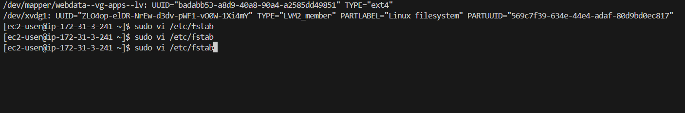

# Web Solution With WordPress

## Step 1 - Prepare a Web Server
What is a WordPress Website?

What is a WordPress websiteA Word Press site is a specialized type of website that makes adding and changing your content, like words, photos, and blog posts easy. It is driven with the help of some tools:

Apache: Undo all your visitors who want to visit your website.

PHP: This is what WordPress uses to run and nice things it does.

MySQL (MariaDB) : Think of this as a giant notebook where WordPress stores everything important, such as your blog posts and settings.

Why Are We Using These Tools?

It is what shows your website to people when they visit your site, therefore apache configuration is important.

WordPress and Apache make your website run, and WordPress can talk to Apache through PHP.

This is what all the data of WordPress is stored in, known as MySQL.


__1.__ __Launch a RedHat EC2 instance that serve as ```Web Server```. Create 3 volumes in the same AZ as the web server ec2 each of 10GB and attache all 3 volumes one by one to the web server__.


_2.__ __Open up the Linux terminal to begin configuration__.

```
sudo yum update && sudo yum upgrade
```


__3.__ __Use ```lsblk``` to inspect what block devices are attached to the server. All devices in Linux reside in /dev/ directory. Inspect with ```ls /dev/``` and ensure all 3 newly created devices are there. Their name will likely be ```xvdf```, ```xvdg``` and ```xvdh```__.

```
lsblk
```


__4.__ __Use ```df -h``` to see all mounts and free space on the server__.

```
df -h
```


_5a.__ __Use ```gdisk``` utility to create a single partition on each of the 3 disks__.
click on 'n' for new partition and when you see another prompt, click on 'w' to write and confrm all changes made

```
sudo gdisk /dev/xvdf
sudo gdisk /dev/xvdg
sudo gdisk /dev/xvdh
```


__5b.__ __Use ```lsblk``` utility to view the newly configured partitions on each of the 3 disks__
```
lsblk
```


__6.__ __Install ```lvm``` package__
```
sudo yum install lvm2 -y
```


then run lvmdisk scan

```
sudo lvmdiskscan
```


__7.__ __Use ```pvcreate``` utility to mark each of the 3 dicks as physical volumes (PVs) to be used by LVM. Verify that each of the volumes have been created successfully__.

```
sudo pvcreate /dev/xvdf1 /dev/xvdg1 /dev/xvdh1

sudo pvs
```


__8.__ __Use ```vgcreate``` utility to add all 3 PVs to a volume group (VG). Name the VG ```webdata-vg```. Verify that the VG has been created successfully__

```
sudo vgcreate webdata-vg /dev/xvdf1 /dev/xvdg1 /dev/xvdh1

sudo vgs
```


__9.__ __Use ```lvcreate``` utility to create 2 logical volume, ```apps-lv``` (__Use half of the PV size__), and ```logs-lv``` (__Use the remaining space of the PV size__). Verify that the logical volumes have been created successfully__.

__Note__: apps-lv is used to store data for the Website while logs-lv is used to store data for logs.

```
sudo lvcreate -n apps-lv -L 14G webdata-vg

sudo lvcreate -n logs-lv -L 14G webdata-vg

sudo lvs
```


__10a.__ __Verify the entire setup__
```
sudo vgdisplay -v   #view complete setup, VG, PV and LV
```


```
lsblk
```


__10b.__ __Use ```mkfs.ext4``` to format the logical volumes with ext4 filesystem__

```bash
sudo mkfs.ext4 /dev/webdata-vg/apps-lv

sudo mkfs.ext4 /dev/webdata-vg/logs-lv
```


__11.__ __Create ```/var/www/html``` directory to store website files and ```/home/recovery/logs``` to store backup of log data__
```bash
sudo mkdir -p /var/www/html

sudo mkdir -p /home/recovery/logs
```
#### Mount /var/www/html on apps-lv logical volume
```bash
sudo mount /dev/webdata-vg/apps-lv /var/www/html
```


__12.__ __Use ```rsync``` utility to backup all the files in the log directory ```/var/log``` into ```/home/recovery/logs``` (This is required before mounting the file system)__

```
sudo rsync -av /var/log /home/recovery/logs
```


__12.__ __Use ```rsync``` utility to backup all the files in the log directory ```/var/log``` into ```/home/recovery/logs``` (This is required before mounting the file system)__

```
sudo rsync -av /var/log /home/recovery/logs
```


__13.__ __Mount ```/var/log``` on ```logs-lv``` logical volume (All existing data on /var/log is deleted with this mount process which was why the data was backed up)__

```
sudo mount /dev/webdata-vg/logs-lv /var/log
```
__8.__ __Use ```mkfs.ext4``` to format the logical volumes with ext4 filesystem and monut ```/db``` on ```db-lv```__

```
sudo mkfs.ext4 /dev/database-vg/db-lv
```
```
sudo mount /dev/database-vg/db-lv /db
```


__14.__ __Restore log file back into ```/var/log``` directory__
```
sudo rsync -av /home/recovery/logs/log/ /var/log
```

__15.__ __Update ```/etc/fstab``` file so that the mount configuration will persist after restart of the server__)

#### Get the ```UUID``` of the device and Update the ```/etc/fstab``` file with the format shown inside the file using the ```UUID```. Remember to remove the leading and ending quotes.
```
sudo blkid   # To fetch the UUID

sudo vi /etc/fstab
```


__16.__ __Test the configuration and reload daemon. Verify the setup__
```
sudo mount -a   # Test the configuration

sudo systemctl daemon-reload

df -h   # Verifies the setup
```


## Step 2 - Prepare the Database Server

### Launch a second RedHat EC2 instance that will have a role - ```DB Server```. Repeat the same steps as for the Web Server, but instead of ```apps-lv```, create ```dv-lv``` and mount it to ```/db``` directory.
follow the same process for apps, server one, instaead of apps create a db aserver and create a db diirectory to save the server


## Step 3 - Install WordPress on the Web Server EC2

__1.__ __Update the repository__
```
sudo yum -y update
```

__2.__ __Install wget, Apache and it's dependencies__

```
sudo yum wget httpd php-fpm php-json
```


__3.__ __Install the latest version of PHP and it's dependencies using the Remi repository__

#### Install the EPEL repository
The package manager ```dnf``` was used here.
It generally offers better performance and more efficient dependency resolution.
```dnf``` is the modern, actively maintained package manager, while yum is older and gradually being phased out.

#### The system version of the RHEL EC2 is version "9"

```
sudo dnf install https://dl.fedoraproject.org/pub/epel/epel-release-latest-9.noarch.rpm
```


#### Install yum utils and enable remi-repository

```
sudo dnf install dnf-utils http://rpms.remirepo.net/enterprise/remi-release-9.rpm
```


#### After the successful installation of yum-utils and Remi-packages, search for the PHP modules which are available for download by running the command.

```
sudo dnf module list php
```


#### The output above indicates that if the currently installed version of PHP is PHP 8.1, there is need to install the newer release, PHP 8.2. Reset the PHP modules.

```
sudo dnf module reset php
```


#### Having run reset, enable the PHP 8.2 module by running

```
sudo dnf module enable php:remi-8.2
```


#### Install PHP, PHP-FPM (FastCGI Process Manager) and associated PHP modules using the command.

```
sudo dnf install php php-opcache php-gd php-curl php-mysqlnd
```


#### To verify the version installed to run.

```
php -v
```


#### Start, enable and check status of PHP-FPM on boot-up.

```
sudo systemctl start php-fpm
sudo systemctl enable php-fpm
sudo systemctl status php-fpm
```


__4.__ __Configure SELinux Policies__

To instruct SELinux to allow Apache to execute the PHP code via PHP-FPM run.

```
sudo chown -R apache:apache /var/www/html
sudo chcon -t httpd_sys_rw_content_t /var/www/html -R
sudo setsebool -P httpd_execmem 1
sudo setsebool -P httpd_can_network_connect=1
sudo setsebool -P httpd_can_network_connect_db=1
```


####  Restart Apache web server for PHP to work with Apache web server.

```
sudo systemctl restart httpd
```


__5.__ __Download WordPress__

Download wordpress and copy wordpress content to /var/www/html

```
sudo mkdir wordpress && cd wordpress
sudo wget http://wordpress.org/latest.tar.gz
sudo tar xzvf latest.tar.gz   # Extract wordpress
```


#### After extraction, ```cd``` into the extracted ```wordpress``` and ```Copy``` the content of ```wp-config-sample.php``` to ```wp-config.php```.

This will copy and create the file wp-config.php

```
cd wordpress/
sudo cp -R wp-config-sample.php wp-config.php
```


#### Exit from the extracted ```wordpress```. Copy the content of the extracted ```wordpress``` to ```/var/www/html```.

```
cd ..
sudo cp -R wordpress/. /var/www/html/
```


__6.__ __Install MySQL on DB Server EC2__

#### Update the EC2
```
sudo yum update -y
```


#### Install MySQL Server
```
sudo yum install mysql-server -y
```


#### Verify that the service is up and running. If it is not running, restart the service and enable it so it will be running even after reboot.

```
sudo systemctl start mysqld
sudo systemctl enable mysqld
sudo systemctl status mysqld
```


#### Create database

The user "wordpress" will be connecting to the database using the Web Server __private IP address__

```
sudo mysql -u root -p

CREATE DATABASE wordpress_db;
CREATE USER 'wordpress'@'172.31.31.27' IDENTIFIED WITH mysql_native_password BY 'Admin123$';
GRANT ALL PRIVILEGES ON wordpress_db.* TO 'wordpress'@'172.31.31.27' WITH GRANT OPTION;
FLUSH PRIVILEGES;
show databases;
exit
```


#### Set the bind address

The bind address is set to the ```private IP address of the DB Server``` for more security instead of to any IP address (0.0.0.0)

```
sudo vi /etc/my.cnf
sudo systemctl restart mysqld
```


#### Open ```wp-config.php``` file and edit the database information

```
cd /var/www/html
sudo vi wp-config.php
sudo systemctl restart httpd
```


The ```private IP address``` of the DB Server is set as the ```DB_HOST``` because the DB Server and the Web Server resides in the same ```subnet``` which makes it possible for them to communicate directly. The private IP address is not an internet routable address.


#### Connect to the DB Server from the Web Server

```bash
sudo mysql -h yourip -u wordpress -p

show databases;
exit;
```


#### Access the web page again with the Web Server public IP address and install wordpress on the browser


## At this point, your fully built wordpress website is ready. the implementation of this project is complete and WordPress is available to be used.


