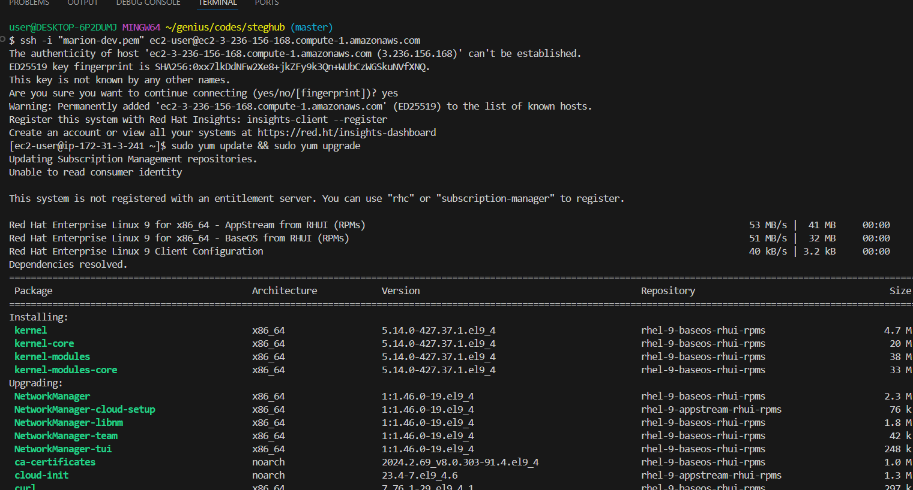
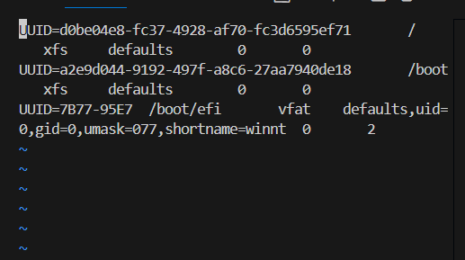

# Web Solution With WordPress

## Step 1 - Prepare a Web Server
What is a WordPress Website?

What is a WordPress websiteA Word Press site is a specialized type of website that makes adding and changing your content, like words, photos, and blog posts easy. It is driven with the help of some tools:

Apache: Undo all your visitors who want to visit your website.

PHP: This is what WordPress uses to run and nice things it does.

MySQL (MariaDB) : Think of this as a giant notebook where WordPress stores everything important, such as your blog posts and settings.

Why Are We Using These Tools?

It is what shows your website to people when they visit your site, therefore apache configuration is important.

WordPress and Apache make your website run, and WordPress can talk to Apache through PHP.

This is what all the data of WordPress is stored in, known as MySQL.


__1.__ __Launch a RedHat EC2 instance that serve as ```Web Server```. Create 3 volumes in the same AZ as the web server ec2 each of 10GB and attache all 3 volumes one by one to the web server__.


_2.__ __Open up the Linux terminal to begin configuration__.

```
sudo yum update && sudo yum upgrade
```




__3.__ __Use ```lsblk``` to inspect what block devices are attached to the server. All devices in Linux reside in /dev/ directory. Inspect with ```ls /dev/``` and ensure all 3 newly created devices are there. Their name will likely be ```xvdf```, ```xvdg``` and ```xvdh```__.

```
lsblk
```


__4.__ __Use ```df -h``` to see all mounts and free space on the server__.

```
df -h
```


_5a.__ __Use ```gdisk``` utility to create a single partition on each of the 3 disks__.
click on 'n' for new partition and when you see another prompt, click on 'w' to write and confrm all changes made

```
sudo gdisk /dev/xvdf
sudo gdisk /dev/xvdg
sudo gdisk /dev/xvdh
```


__5b.__ __Use ```lsblk``` utility to view the newly configured partitions on each of the 3 disks__
```
lsblk
```


__6.__ __Install ```lvm``` package__
```
sudo yum install lvm2 -y
```


then run lvmdisk scan

```
sudo lvmdiskscan
```


__7.__ __Use ```pvcreate``` utility to mark each of the 3 dicks as physical volumes (PVs) to be used by LVM. Verify that each of the volumes have been created successfully__.

```
sudo pvcreate /dev/xvdf1 /dev/xvdg1 /dev/xvdh1

sudo pvs
```


__8.__ __Use ```vgcreate``` utility to add all 3 PVs to a volume group (VG). Name the VG ```webdata-vg```. Verify that the VG has been created successfully__

```
sudo vgcreate webdata-vg /dev/xvdf1 /dev/xvdg1 /dev/xvdh1

sudo vgs
```


__9.__ __Use ```lvcreate``` utility to create 2 logical volume, ```apps-lv``` (__Use half of the PV size__), and ```logs-lv``` (__Use the remaining space of the PV size__). Verify that the logical volumes have been created successfully__.

__Note__: apps-lv is used to store data for the Website while logs-lv is used to store data for logs.

```
sudo lvcreate -n apps-lv -L 14G webdata-vg

sudo lvcreate -n logs-lv -L 14G webdata-vg

sudo lvs
```


__10a.__ __Verify the entire setup__
```
sudo vgdisplay -v   #view complete setup, VG, PV and LV
```


```
lsblk
```


__10b.__ __Use ```mkfs.ext4``` to format the logical volumes with ext4 filesystem__

```bash
sudo mkfs.ext4 /dev/webdata-vg/apps-lv

sudo mkfs.ext4 /dev/webdata-vg/logs-lv
```


__11.__ __Create ```/var/www/html``` directory to store website files and ```/home/recovery/logs``` to store backup of log data__
```bash
sudo mkdir -p /var/www/html

sudo mkdir -p /home/recovery/logs
```
#### Mount /var/www/html on apps-lv logical volume
```bash
sudo mount /dev/webdata-vg/apps-lv /var/www/html
```


__12.__ __Use ```rsync``` utility to backup all the files in the log directory ```/var/log``` into ```/home/recovery/logs``` (This is required before mounting the file system)__

```
sudo rsync -av /var/log /home/recovery/logs
```


__12.__ __Use ```rsync``` utility to backup all the files in the log directory ```/var/log``` into ```/home/recovery/logs``` (This is required before mounting the file system)__

```
sudo rsync -av /var/log /home/recovery/logs
```


__13.__ __Mount ```/var/log``` on ```logs-lv``` logical volume (All existing data on /var/log is deleted with this mount process which was why the data was backed up)__

```
sudo mount /dev/webdata-vg/logs-lv /var/log
```


__14.__ __Restore log file back into ```/var/log``` directory__
```
sudo rsync -av /home/recovery/logs/log/ /var/log
```

__15.__ __Update ```/etc/fstab``` file so that the mount configuration will persist after restart of the server__)

#### Get the ```UUID``` of the device and Update the ```/etc/fstab``` file with the format shown inside the file using the ```UUID```. Remember to remove the leading and ending quotes.
```
sudo blkid   # To fetch the UUID

sudo vi /etc/fstab
```


__16.__ __Test the configuration and reload daemon. Verify the setup__
```
sudo mount -a   # Test the configuration

sudo systemctl daemon-reload

df -h   # Verifies the setup
```


## Step 2 - Prepare the Database Server

### Launch a second RedHat EC2 instance that will have a role - ```DB Server```. Repeat the same steps as for the Web Server, but instead of ```apps-lv```, create ```dv-lv``` and mount it to ```/db``` directory.

__1.__ __Create 3 volumes in the same AZ as the ```DB Server``` ec2 each of 10GB and attache all 3 volumes one by one to the DB Server__.


__2.__ __Open up the Linux terminal to begin configuration__.

```bash
ssh -i "ec2key.pem" ec2-user@18.209.18.145
```


__3.__ __Use ```lsblk``` to inspect what block devices are attached to the server. Their name will likely be ```xvdf```, ```xvdg``` and ```xvdh```__.

```bash
lsblk
```


__4a.__ __Use ```gdisk``` utility to create a single partition on each of the 3 disks__.

```bash
sudo gdisk /dev/xvdf
```


```bash
sudo gdisk /dev/xvdg
```


